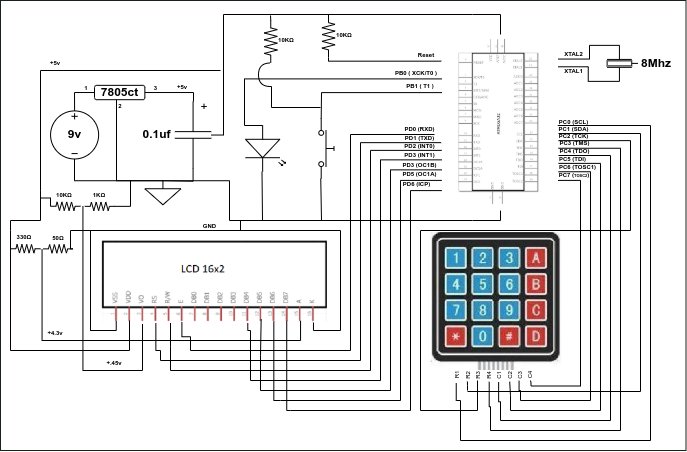
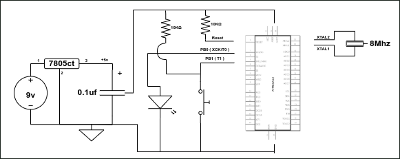

# UCI Embedded Systems – AVR Microcontroller Programming

Welcome to the repository for the UCI Embedded Software class.

## 🎯 Objective

The main goal of this course is to gain hands-on experience in:

- Programming AVR microcontrollers (MCUs) in C
- Interfacing with a wide range of hardware components
- Reading and applying datasheet specifications to real hardware systems
- Understanding low-level control of digital I/O, timers, communication protocols, and more

---

## 📁 Projects

Each project demonstrates a specific concept or peripheral, including schematics and diagrams for clarity.

### Project Diagrams

Below are visual references stored in the `diagram/` directory:

<!-- Example image links below. Replace or add filenames as needed -->
#### Project 2

#### Project 1

---

## 🔧 Tools and Setup

- **MCU:** ATmega32 / ATmega328P
- **Language:** C (AVR-GCC)
- **IDE:** [Microchip Studio for AVR® and SAM Devices](https://www.microchip.com/en-us/tools-resources/develop/microchip-studio)
- **Programmer:** USBasp / Atmel-ICE
- **Platform:** Linux / Windows

---

